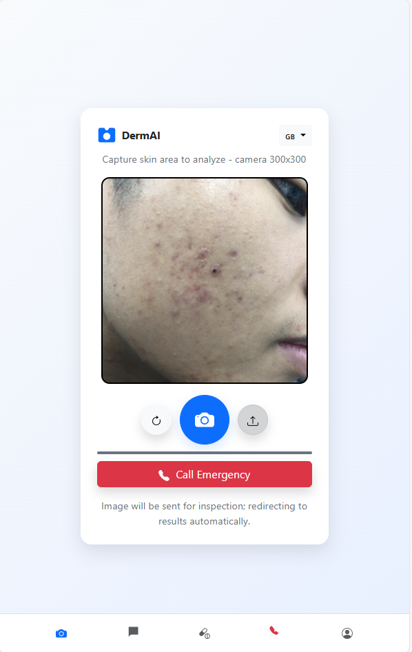
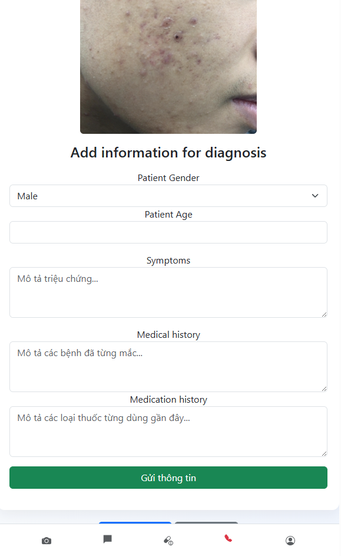
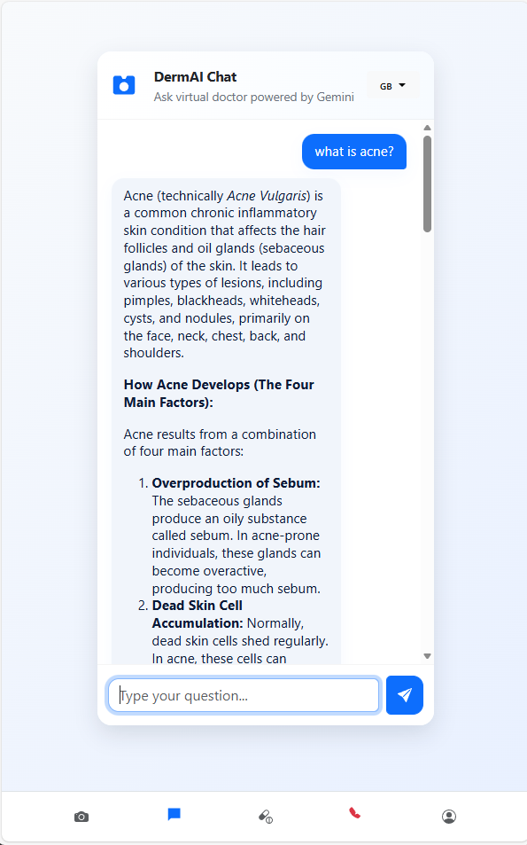
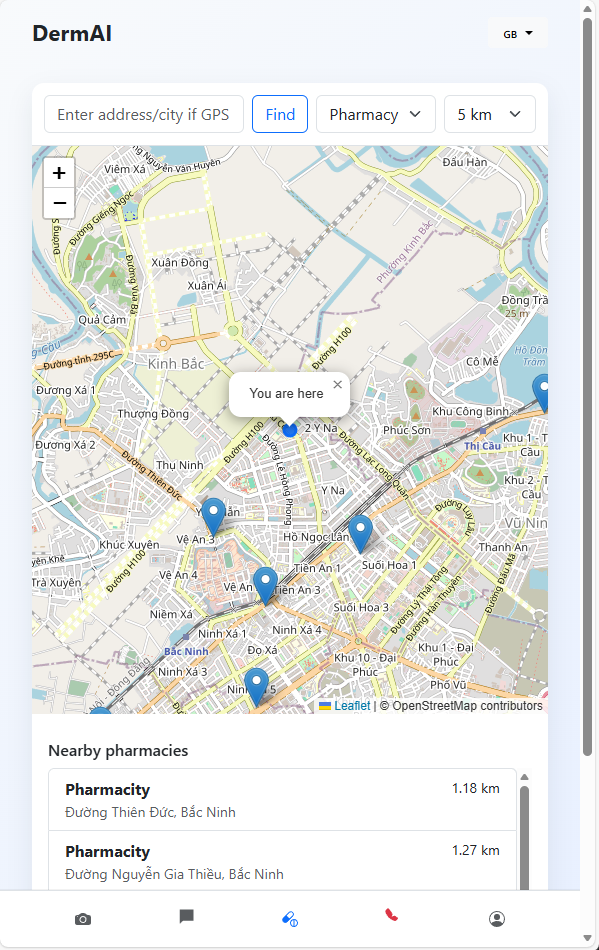
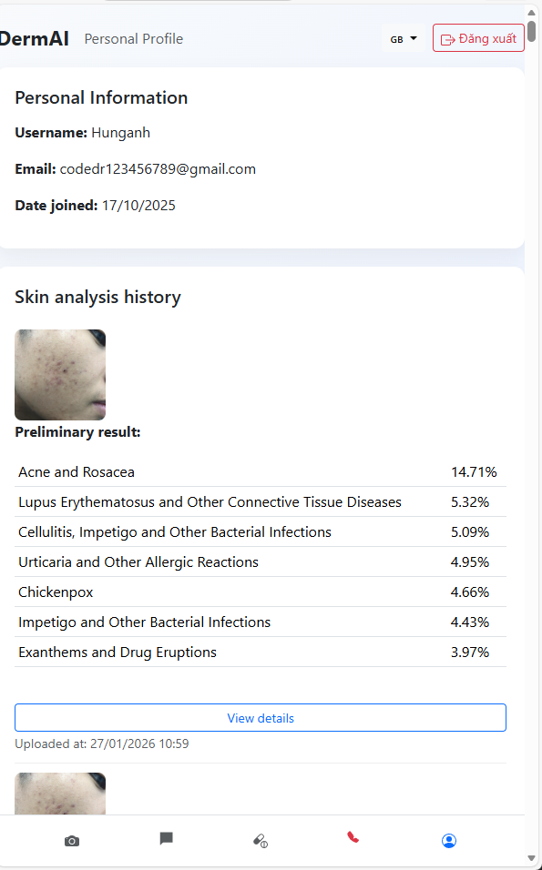

# 🌐 DermAI Web Platform

This repository contains the source code for the central web platform of DermAI, providing an accessible and intuitive web interface for AI-assisted skin condition analysis.

---

## 🚀 Features & UI Showcase

### 1. Basic AI Diagnosis
Upload skin images to receive instant disease classification probabilities along with a Grad-CAM heatmap highlighting affected regions.

---

### 2. Advanced Symptom-Based Analysis
Combines image recognition results with user-reported clinical symptoms using Gemini LLM to generate comprehensive diagnostic reports.

---

### 3. AI Medical Assistant
An interactive AI chatbot powered by Gemini LLM, providing 24/7 answers to dermatological questions and skincare advice.

---

### 4. Nearby Healthcare Locator
Uses Leaflet open-source mapping API to automatically display nearby specialized dermatological clinics and hospitals.

---

### 5. Account & Medical Record Management
Secure user authentication with encrypted password storage, allowing users to safely store and review past diagnostic history.

---

## 🛠️ Tech Stack
* **Backend Framework**: Django
* **Database**: PostgreSQL (hosted on Neon.tech)
* **Frontend**: HTML5, CSS3, JavaScript, Bootstrap
* **AI & Cloud Integrations**: FastAPI (AI Server), Gemini LLM API, Cloudinary, Leaflet API
* **Deployment**: Render

---

> **⚠️ MEDICAL DISCLAIMER**: Results provided by DermAI are strictly for diagnostic reference and do not replace professional medical consultation.

📬 **Contact**: For source code inquiries or detailed project documentation, please contact me at: **hoanghunganh9544@gmail.com**
